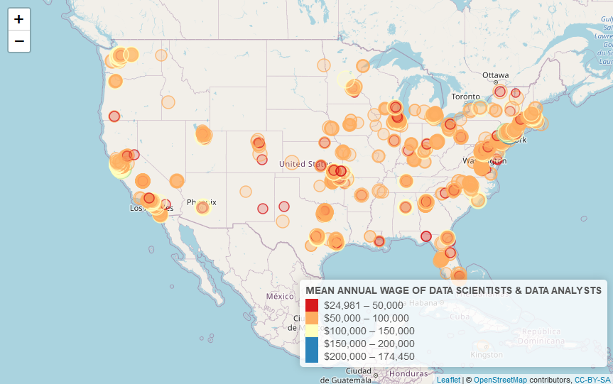
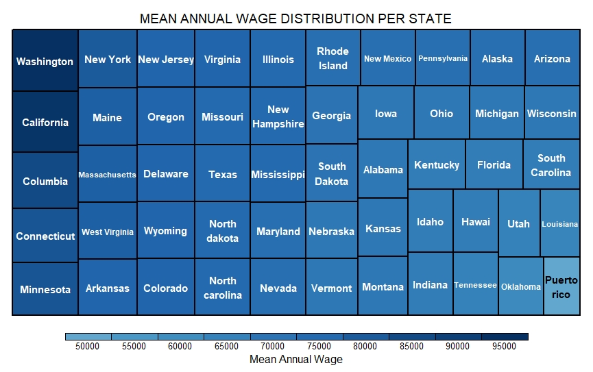
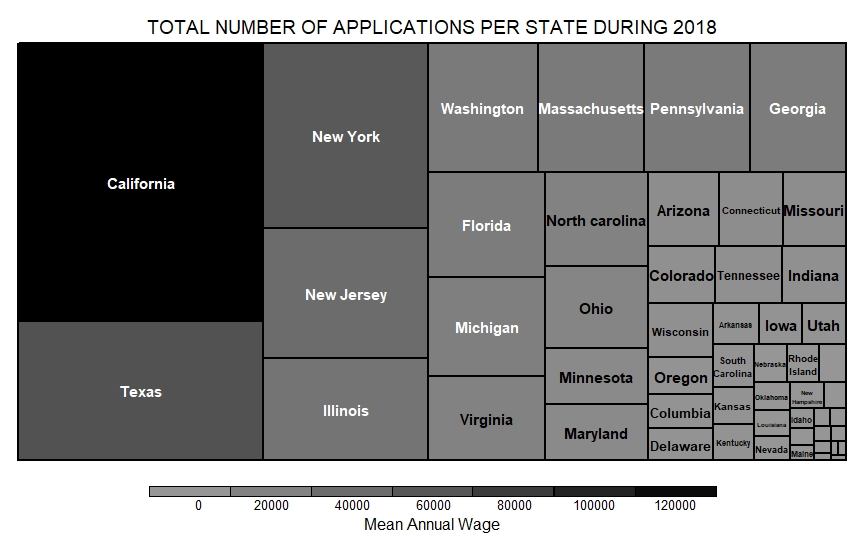
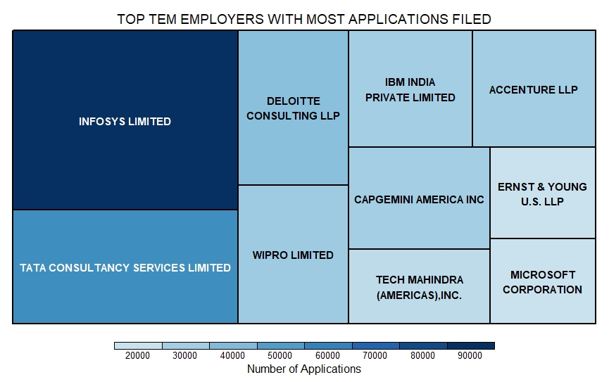
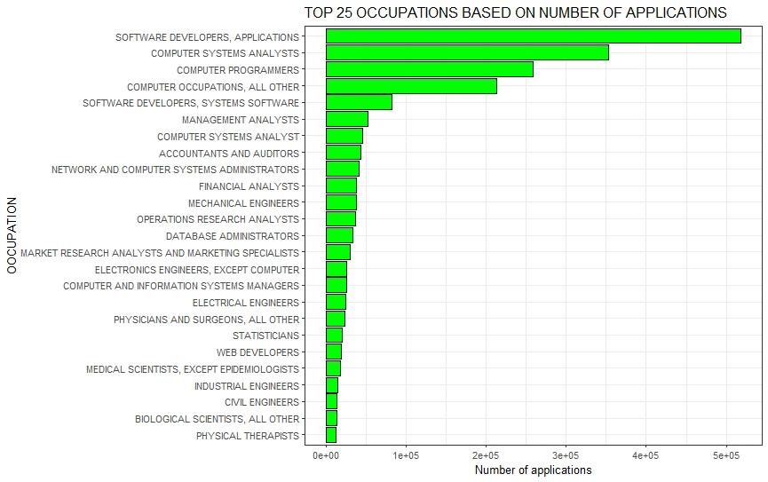
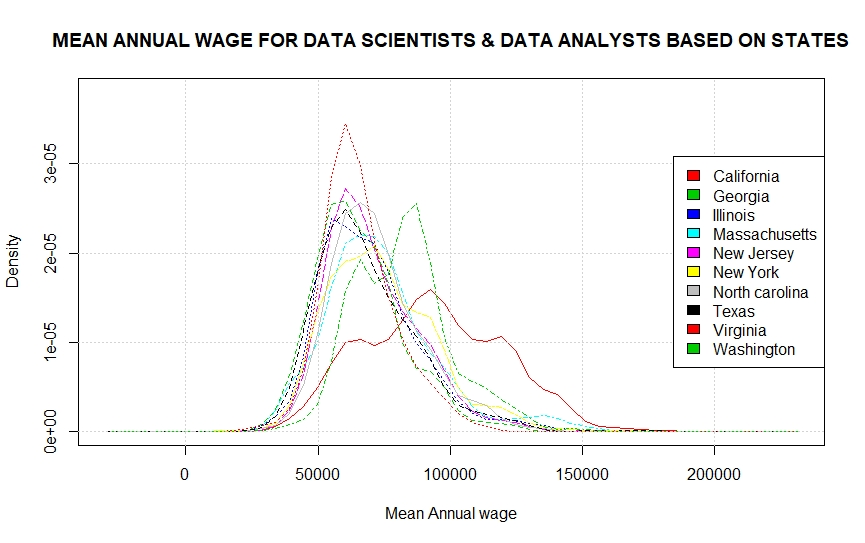
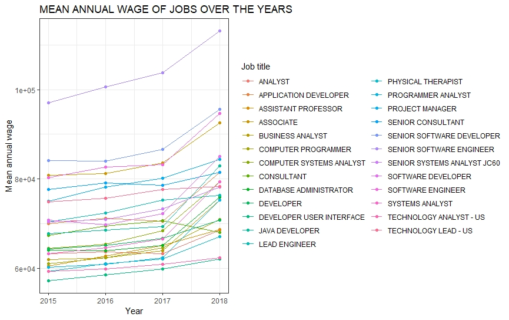
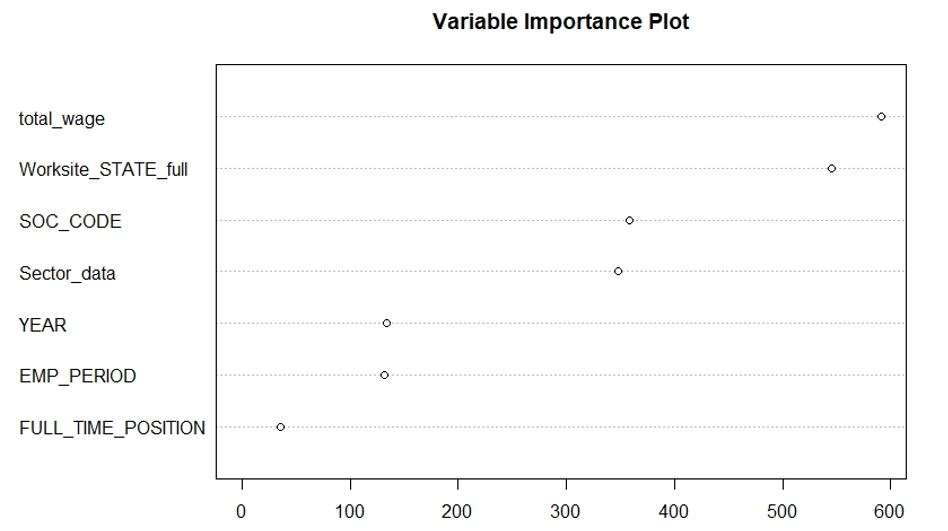

# H1B-Prediction
Wanna know whether your case status will get approved if you apply for H1-B visa?. Don't worry!!! I have created a webpage that is built on **django** which uses classification machine learning algorithm to give you the prediction. Also, take a look at the statistical findings to get a knowledge about the important factors behind the scene:) which is presented using **R** and **Python**.

### <ins>Table of contents</ins>:
  - [ Introduction ](#intro)
  - [ Data Description ](#desc)
  - [ EDA ](#eda)
  - [ Result ](#res)
  - [ Conclusion ](#con)
  

### Introduction:
Every year hundreds of students come to US with the hope of a successful career. The main motivation for most of the students to come to US is the demand of high job prospects and high wages. For any student to work in US, they must acquire a H-1B visa from the U.S. Citizenship and Immigration Services (USCIS). The steps involved in this process is as follows: 
  - Finding an H1B Sponsor
  - Employer Submits Labour Conditions Approval (LCA)
  - Employer Submits Form I-129
  - Applicant Completes Application at a US Embassy or Consulate

So,the quest to solve the questions like wo are the companies that are filling Labour Conditions Approval (LCA)? , which roles or job titles are filled for LCA?, where these roles are mostly centralized?, how much wages are provided to corresponding roles?, what is the case of a “Data Analyst or Scientist”?. i have used predictive modeling and a data mining approach.

### Data Description:
We considered the data from 2014-2018 which has an combined entry of about 2545660 and around 50 features. After applying Dimensionality reduction and feature selection, I have considered the top 10 features that captures the variance better which is listed [ here ](#table) 

The data pre-processing involed:
  - Data imputation
  - Truncated and Factorised the SOC code and Sector code
  - data wrangling
  - Geo coding to obtain the geo locations of the applicant's state and county
  - Multinomial to Binomial classification
  - Tackled class imbalance using methods like under sampling, over sampling, smote, etc
 

### Exploratory Data Analysis: 

|  | 
|:--:| 
| **Mean Annual wage of data analysts/scientist** ( https://rpubs.com/aanbara/641014 ) |

|  | 
|:--:| 
| *Mean Annual wage distribution per state* |

|  | 
|:--:| 
| *Total applications per state* |

 |  | 
|:--:| 
| *Top 10 employers with most applications filed* |

 |  | 
|:--:|:--: 
| *Top 25 occupations based on no. of applicants* | *Mean annual wage of Data Analysts/Scientists based on states*

 |  |
|:--:|
| *Mean annual wage of Jobs* |

### Result:

The best model obtained is using Support Vector Machine as you can see from the table below. Thia is the background algorithm used in the webpage.

| Model |	Predictive Accuracy |	Precision Positive | Precision Negative |	Error Rate | Sensitivity | Specificity |
| ----------- | ----------- | ----------- | ----------- | ----------- | ----------- | ----------- |
| LOGISTIC REGRESSION |	63.95 |	66.38	| 64.97 |	36.05 |	62.53	| 64.97 | 
| naive Bayes Classifier | 66.95 | 78.92 | 70.81 | 33.05 | 64.66 | 70.81 |
| CART | 64.63 | 70.34 | 65.06 | 35.36 | 64.29 | 65.06 |
| RANDOM FOREST |	73.05 |	82.49 |	77.25 |	26.94 |	70.31 |	77.25 |
| GRADIENT BOOSTING |	67.63	| 75.78 |	69.67 |	32.37 |	66.21 |	69.67 |
| **SUPPORT VECTOR MACHINE (SVM)** | **78.69** | **88.12** | **84.50** | **21.30** |	**74.91** |	**84.50** |

 |  |
|:--:|
| *Variable Importance plot* |

### Conclusion:

Well, Don't choose fields other than software :P. As you can see, the sofware field is where the most applications were filed, more favourable results were seen and the wage is pretty. But, people who followed their passion by choosing other fields, if you want to have better chance of getting your H1-B approved, target specific companies that sponser more applicants in their respecive field and in most prosperous states like california, washington, etc as seen in the inference and finally, find a job that pays you highhhh! 

### Data features
| Field | Meaning |
| ----------- | ----------- |
| CASE STATUS | decision variable| 
| SOC CODE | Occupational code  | 
| SECTOR CODE | Industry code | 
| EMPLOYMENT PERIOD | Total duration of employment requested for the applicant. | 
| TOTAL WAGE | Total Wage per year for the job | 
| YEAR | Application Year | 
| SOC CODE | Occupational code  | 
| FULL TIME POSITION | whether the applicant has a full-time |
